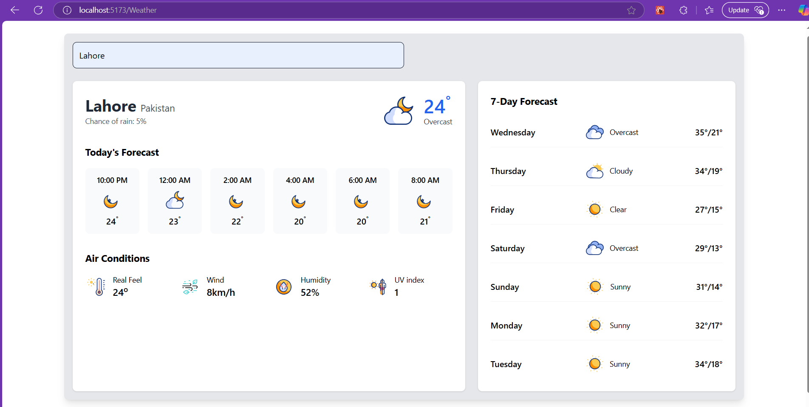

Weather App

Overview

This is a Weather App built using React. The app allows users to search for the weather information of any city and displays the current temperature, humidity, wind speed, UV index, and real feel temperature.

Features

Built with React: 
Utilizes React for a dynamic and interactive UI.

Uses APIs: Fetches real-time weather data using an external weather API.

Routing Added: Implemented React Router for navigation.

Tailwind CSS: Styled using Tailwind CSS for a modern and responsive design.

Responsive Design: Works on both mobile and desktop devices.

Tech Stack
React (For UI & state management)

React Router (For navigation)

Tailwind CSS (For styling)

Weather API (For fetching weather data)
API Used
Weather API: OpenWeatherMap

Fetch Example:
const geoCodeUrl = `https://geocoding-api.open-meteo.com/v1/search?name=${debouncedInput}&count=10&language=en&format=json`;

const weatherUrl = `https://api.open-meteo.com/v1/forecast?latitude=${latitude}&longitude=${longitude}&daily=temperature_2m_max,temperature_2m_min,precipitation_probability_max,weathercode,sunrise,sunset&hourly=temperature_2m,relative_humidity_2m,wind_speed_10m,weathercode,precipitation_probability,apparent_temperature,uv_index&timezone=auto&forecast_days=7`;

Screenshot

